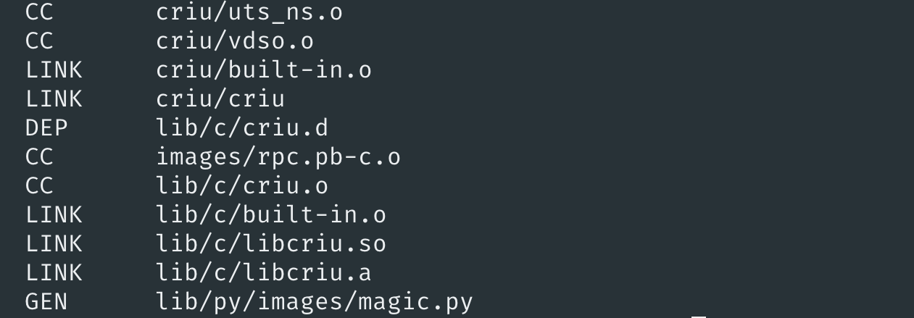
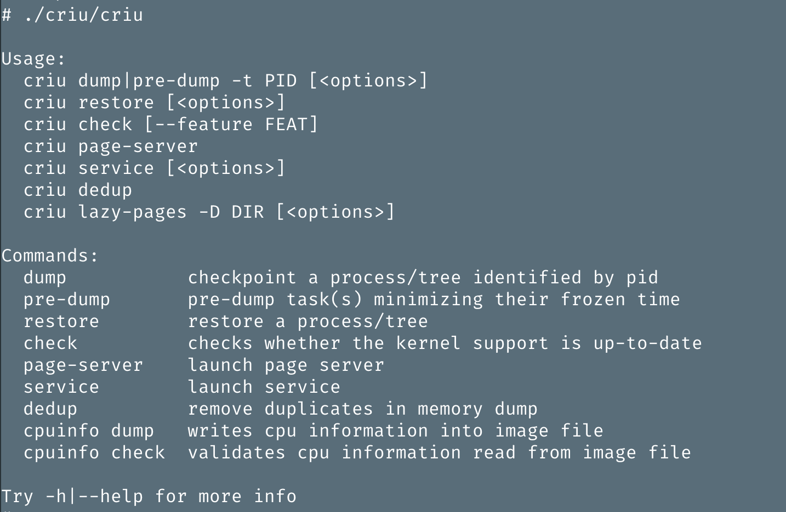
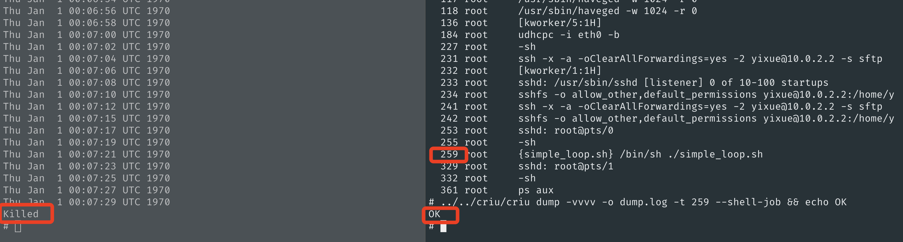
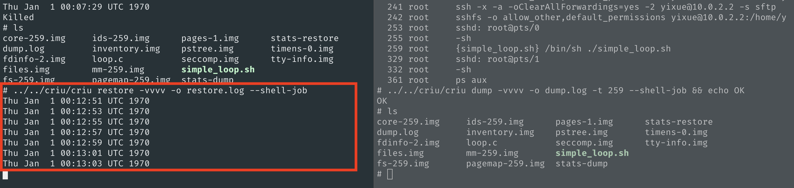

# Get Started with CRIU on HPSC (internal)

This tutorial will set up CRIU on your HPSC 1.2.0. You will be able to checkpoint/restore a simple loop example in the end! :)


## Cross Compile CRIU's Required Packages

The details of what packages CRIU needs can be found on [CRIU's website](https://criu.org/Installation). In this release, we only cross compile 5 packages that CRIU requires, namely, `protobuf, protobuf-C, libnet, libcap, libnl`.

You have 2 options: (1) use the cross compiled artifacts directly, or (2) cross compile your own where you can choose specific versions of the packages you want to use.

### Option 1 - Download Directly (Recommended)

You can download the cross compiled artifacts `cross-compile-riscv64-artifacts` directly using [this link from Google Drive](https://drive.google.com/file/d/1mVjaQfWJVPbPQMXsdxPaju__Db6SyxPB/view?usp=sharing). Make sure you exact it afterwards.

### Option 2 - Cross Compile Your Own

If you want to cross compile your own packages, you can reuse the cross compile scripts in [this folder](https://github.com/usc-isi/criu/tree/HPSC-RISCV64-CC/scripts/hpsc-CC). For example, `build_protobuf.sh` cross compiles `protobuf` and `protobuf-c` and you can specify the versions you desire in the scripts.


## Cross Compile CRIU

1. Download the latest CRIU source code from `https://github.com/usc-isi/criu/tree/HPSC-RISCV64-CC` on your host machine.

	```bash
		git clone --branch HPSC-RISCV64-CC https://github.com/usc-isi/criu.git
	```

2. Update `scripts/hpsc-CC/config.sh` file with your local paths, such as `TOOLCHAIN_ROOT`, `CRIU_ROOT_DIR`, `BUILD_ROOT_DIR` (this should be the directory of the cross compiled packages you downloaded from the previous step, i.e., `cross-compile-riscv64-artifacts`).

3. Cross compile CRIU with required packages using the script provided in `scripts/hpsc-CC/build_criu.sh`.

	```bash
		cd criu/scripts/hpsc-CC
		./build_criu.sh 
	```

This process should take a few minutes. You'll see something like this in the end of the build.



## Configure Linux

CRIU requires some specific Linux configurations to function. This step is very important as CRIU wouldn't work without the proper Linux configuration. Note that your internal `hpsc` environment might be different from mine, so if you already know how to configure Linux, you can just do it in your own way. :) Please follow [CRIU's Linux kernel page](https://criu.org/Linux_kernel) to turn on specific configurations.

1. Assuming you already have `hpsc` folder populated with source code, then we'll use menuconfig to configure the Linux kernel (you may need to update `$PATH` so that the RISC-V toolchain can be found). You can use `/` in menuconfig to search where the config option is located and whether it's already enabled or not.

*Yixue Notes: I didn't find `CONFIG_MEM_SOFT_DIRTY`, which is optional for CRIU's checkpoint/restore functionalities. However, it is needed for incremental dumps (CRIU's "pre-dump" feature that optimizes performance).*


```bash
	cd hpsc/linux/hpsc-linux # where Makefile.hpsc is located
	make -f Makefile.hpsc-qemu hpsc_build=hpsc-qemu menuconfig
```

This step will generate `hpsc/linux/hpsc-linux/hpsc-builds/hpsc-qemu/.config` (Do not change the default name `.confg`).

2. Run the following command in the same folder to generate the updated `hpsc-qemu.cfg` in `hpsc/linux/hpsc-linux/hpsc-configs`.

	```bash
	make -f Makefile.hpsc-qemu hpsc_build=hpsc-qemu updateconfig
	```

3. Go to the `hpsc` folder run the following command to build hpsc linux image with the new configuration.

	```bash
	cd ../.. # go back to the hpsc folder
	make hpsc_linux_image hpsc_package
	```

4. To test if your new Linux configuration is in effect, in your QEMU, run `zcat /proc/config.gz` to print out the configuration. I highly recommend double checking because CRIU will not work without the correct Linux configuration.


## Run CRIU on HPSC

We will demonstrate CRIU's checkpoint/restore functionalities using a simple loop example. Note that this is a quick start to try out CRIU on QEMU and restarting QEMU will lose everything about CRIU, so all the steps will need to be repeated again. We don't want that for the customer. The purpose of these steps are showing Microchip what steps are needed to run CRIU so that we can figure out a sustainable way to integrate CRIU into HPSC as a built-in library.

1. Modify `hpsc/makefile` to set up a fixed port to `ssh` into QEMU. We will need multiple ssh sessions. For example, you can modify the end of the `run_sim` from `hostfwd=tcp::-:22` to `hostfwd=tcp::2222-:22` so that we use port `2222` to ssh into QEMU. The complete ending of `run_sim` is shown below. We'll use port `2222` throughout this tutorial as an example.

	```make
	 	-netdev user,id=cluster0_eth0,dhcpstart=10.0.2.15,hostfwd=tcp::2222-:22 \
        	-device loader,file=$${ZSBL_PATH},addr=$${ZSBL_ADDR}
	```


2. Start QEMU using buildroot by running the following command in 2 separate sessions.

	```bash
		HPSC_QEMU_MSEL=1 make run_sim
		HPSC_QEMU_MSEL=1 make run_linux_minicom # run in a separate session
	```

3. Mount CRIU's cross compiled code (the `criu` folder that you cross compiled in the previous steps) by running the following command in QEMU.

	```bash
		sshfs -o allow_other,default_permissions <host user ID>@10.0.2.2:<criu_folder_path> /mnt
		# example: sshfs -o allow_other,default_permissions yixue@10.0.2.2:/home/yixue/clean_space/criu/ /mnt
	```

4. Mount the `libs` of CRIU's required packages (the `cross-compile-riscv64-artifacts/riscv64_pb_install/lib/` folder that you downloaded in the previous steps) and add it to `/usr/lib` by running the following command in QEMU.

	```bash
		# in the root folder on QEMU
		mkdir lib
		sshfs -o allow_other,default_permissions <host user ID>@10.0.2.2:<riscv_lib_folder_path> /root/lib
		# example: sshfs -o allow_other,default_permissions yixue@10.0.2.2:/home/yixue/clean_space/cross-compile-riscv64-artifacts/riscv64_pb_install/lib/ /root/lib
		cp -Rn lib/* /usr/lib/
	```

5. You can test out whether CRIU is successfully set up by running the following command.

	```bash
		cd /mnt
		./criu/criu
	```

If you see CRIU's manual like this below, you're all set! :)


## Test CRIU with Simple Loop

Finally, now we can checkpoint/restore a simple loop! We'll use CRIU's [simple loop example](https://criu.org/Simple_loop) for demonstration.


1. `ssh` into QEMU as we'll need multiple sessions at the same time by running `ssh -p 2222 root@localhost` (assuming the port number is set up as `2222` in the previous steps). If you see a dramatic waring like this below, you can run `ssh-keygen -f "<.ssh_folder_path>/known_hosts" -R "[localhost]:2222"` (e.g., `ssh-keygen -f "/home/yixue/.ssh/known_hosts" -R "[localhost]:2222"`), and then `ssh -p 2222 root@localhost` again.

	```bash
		@@@@@@@@@@@@@@@@@@@@@@@@@@@@@@@@@@@@@@@@@@@@@@@@@@@@@@@@@@@
		@    WARNING: REMOTE HOST IDENTIFICATION HAS CHANGED!     @
		@@@@@@@@@@@@@@@@@@@@@@@@@@@@@@@@@@@@@@@@@@@@@@@@@@@@@@@@@@@
		IT IS POSSIBLE THAT SOMEONE IS DOING SOMETHING NASTY!
		Someone could be eavesdropping on you right now (man-in-the-middle attack)!
		......
	```

2. Run the simple loop program on QEMU.

	```bash
		cd /mnt/test/simpleloop
		./simple_loop.sh
	```

3. `ssh` into another session on QEMU and find the process id of the `simple_loop.sh` program that's running using `ps aux`. With the known `pid`, we can checkpoint the simple loop program!

	```bash
		ssh -p 2222 root@localhost
		cd /mnt/test/simpleloop
		../../criu/criu dump -vvvv -o dump.log -t <pid> --shell-job && echo OK

	```

You should see something like this in the 2 sessions.


4. Now you can restore the simple loop! You'll notice that CRIU has dumped multiple `.img` files in the same folder that will be used to restore the process.

```bash
	# in the same folder that contains .img files, e.g., simpleloop folder
	../../criu/criu restore -vvvv -o restore.log --shell-job
```

You'll see the simple loop program is back to life yay! Congrats! Now you've succesfully tested CRIU on HPSC! 🎊


