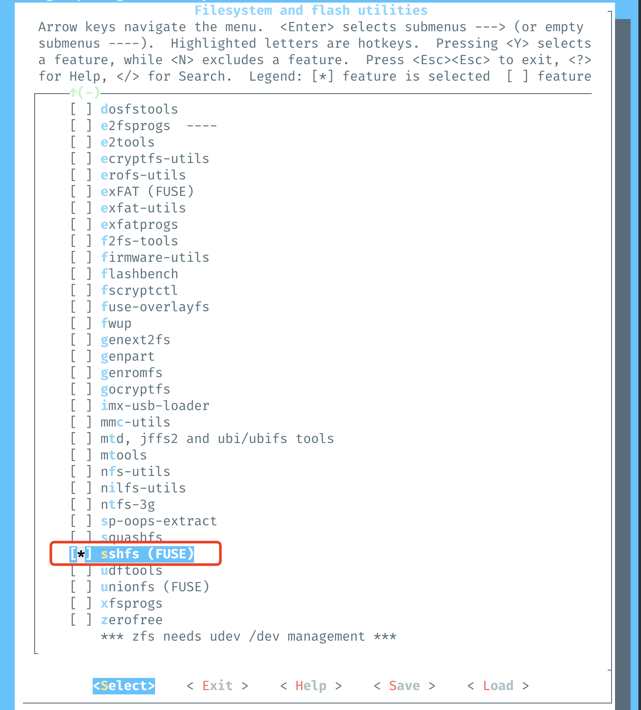
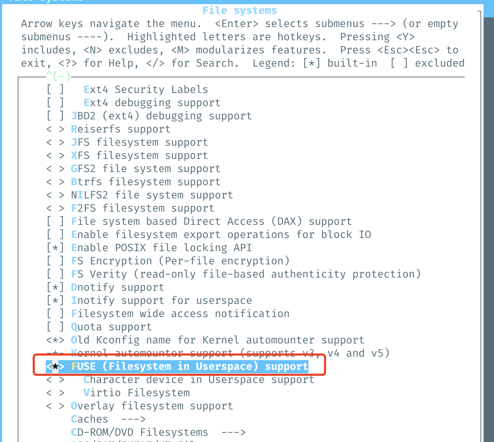
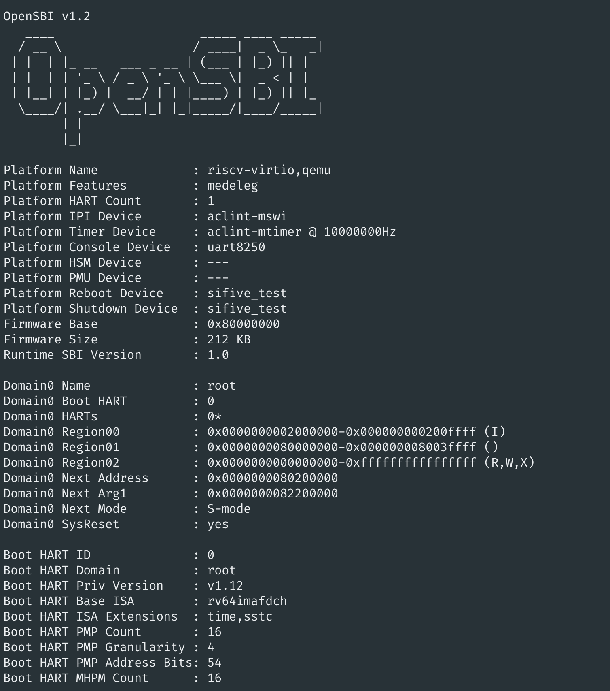
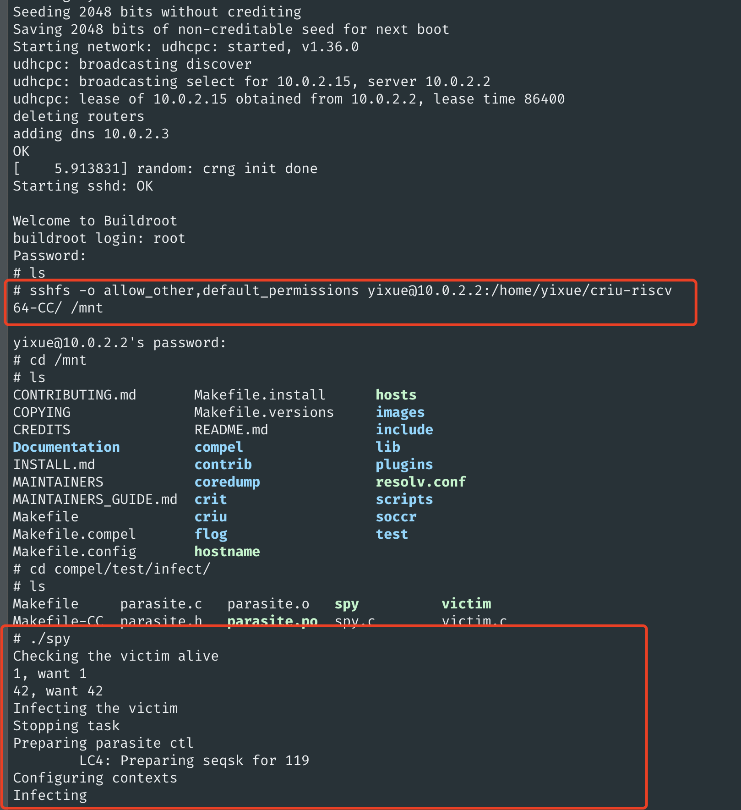

# Set Up RISC-V Cross Compile Development Environment

If you don't have a RISC-V physical board, simulation is your best friend :) In this tutorial, we will set up your development environment to cross compile CRIU on a host machine (I used X86 Ubuntu), and then run CRIU on RISC-V QEMU with Linux. Let's get started!

### Install RISC-V GNU Compiler Toolchain

See official instruction for [RISC-V GNU Compiler Toolchain Installation](https://github.com/riscv-collab/riscv-gnu-toolchain).

This step is straightforward, but takes some time to build (it varies in different machines, but as a heads up, the step `make linux` took more than an hour for me). 

### Use Buildroot to Build RISC-V QEMU Linux

Note [this instruction](https://risc-v-getting-started-guide.readthedocs.io/en/latest/linux-qemu.html) from RISC-V's website is not up to date. You may face many issues due to the inconsistencies in the versions and/or configuration conflicts across QEMU, Linux, and root file system. I recommend using Buildroot and that's what we'll focus here.

1. Download Buildroot from [here](https://buildroot.org/download.html) and unzip it.
```shell
# replace the link to the latest version
wget https://buildroot.org/downloads/buildroot-2023.02.tar.gz
tar -xvf buildroot-2023.02
cd buildroot-2023.02
```

2. You can use the default configuration to build QEMU, the Linux kernel and the root filesystem as shown below. As a heads up, this step can take a while.

```shell
# do this in the root directory of buildroot, e.g., buildroot-2023.02
make qemu_riscv64_virt_defconfig
make -j $(nproc)
```

3. For our purpose, it would be very convenient to enable `sshfs` to share directory from the host to QEMU. In this case, we'll customize the build as below.

```shell
# do this in the root directory of buildroot, e.g., buildroot-2023.02
make menuconfig
```

In the menu, select `Target packages > Filesystem and flash utilities > sshfs (FUSE)`. Use space to select it. Save the configuration and exit.



Then enable FUSE driver.
```shell
# do this in the root directory of buildroot, e.g., buildroot-2023.02
make linux-menuconfig
```

In the menu, select `File systems > FUSE (Filesystem in Userspace) support`. Use space to select it. Save the configuration and exit.



Then trigger the customized build.

```shell
# do this in the root directory of buildroot, e.g., buildroot-2023.02
make -j $(nproc)
```


4. Now you can log into your RISC-V QEMU! The default username is `root` with empty password. To exit QEMU, press `Ctrl+A` and then `X`.


```shell
# do this in the root directory of buildroot, e.g., buildroot-2023.02
cd output/images
./start-qemu.sh
```



### Cross Compile CRIU

Assuming you have installed [RISC-V GNU Compiler Toolchain](https://github.com/riscv-collab/riscv-gnu-toolchain) in the first step, now follow this [README](https://github.com/felicitia/criu/blob/riscv64-CC/scripts/cross-compile/README.md) to cross compile CRIU for RISC-V target using the toolchain you installed.

### Test CRIU on RISC-V QEMU Using `sshfs`

**Prereqisite**: You need to cross compile CRIU successfully for RISC-V target following the previous step, e.g., the `config.sh` in the previous step should be set up properly according to your environment.

We will use a simple example to run a test case under CRIU's `compel` module. You can build the `$CRIU_ROOT_DIR/compel/test/infect` test case by running [`build_compel_test.sh`](https://github.com/felicitia/criu/blob/riscv64-CC/scripts/cross-compile/build_compel_test.sh). Note that this script calls for `Makefile-CC` under `$CRIU_ROOT_DIR/compel/test/infect` that's not in the main CRIU branch. You can find `Makefile-CC` [here](https://github.com/felicitia/criu/blob/riscv64-CC/compel/test/infect/Makefile-CC).

```shell
# do this in $CRIU_ROOT_DIR/scripts/cross-compile
./build_compel_test.sh
```

This will generate executable for RISC-V target under `$CRIU_ROOT_DIR/compel/test/infect` as shown below.


To run `./spy` test case, log into your RISC-V QEMU environment by running `./start-qemu.sh` as mentioned above. In your QEMU environment, share the `$CRIU_ROOT_DIR` directory in your host with QEMU.

```shell
# do this in your QEMU environment
sshfs -o allow_other,default_permissions <host user ID>@10.0.2.2:<path of $CRIU_ROOT_DIR directory> /mnt
```

Congrats! 🥳 You will see your `$CRIU_ROOT_DIR` directory in QEMU now and you can run it!



#### References
1. https://embeddedinn.xyz/articles/tutorial/RISCV-Uncovering-the-Mysteries-of-Linux-Boot-on-RISC-V-QEMU-Machines/
2. https://risc-v-getting-started-guide.readthedocs.io/en/latest/linux-qemu.html
3. https://github.com/riscv-collab/riscv-gnu-toolchain
